# 🦟 Plataforma de Alerta Temprana de Malaria · Perú

**Sistema de pronóstico probabilístico de casos de malaria por distrito y semana
epidemiológica**, construido con Machine Learning y prácticas MLOps sobre datos
reales del Ministerio de Salud del Perú (CDC/DGE-MINSA, 2000–2024).

> Predice cuántos casos de malaria habrá en cada distrito del Perú en las
> próximas 1 a 4 semanas, **con intervalos de predicción del 80 %**, para que
> las autoridades de salud prioricen recursos antes de que ocurran los brotes.


---

## 📌 Resumen ejecutivo (TL;DR para reclutadores)

| Pregunta | Respuesta corta |
|---|---|
| **¿Qué hace?** | Pronostica casos semanales de malaria en 1,645 distritos, 1 a 4 semanas adelante, con cuantiles q0.1 / q0.5 / q0.9. |
| **¿Con qué datos?** | 25 años de vigilancia epidemiológica oficial (1.21 M casos, 143,502 registros distrito × semana; 610,915 filas tras completar la grilla semanal). |
| **¿Qué modelo ganó?** | LightGBM con pérdida cuantil (un modelo por horizonte y cuantil), elegido por un proceso **Champion/Challenger** contra 3 baselines y registrado en **MLflow**. |
| **¿Qué tan bueno es?** | En el **hold-out 2021–2024** (nunca usado para elegir modelo): WAPE **0.41** a 1 semana, **12 % mejor** que el mejor baseline (IC 95 % bootstrap: 9.9 % a 14.0 %; Diebold-Mariano p < 10⁻²⁰). |
| **¿Es estadísticamente sólido?** | Sí: validación walk-forward sin fuga temporal, test fuera de muestra, IC por bootstrap de bloques, test de Diebold-Mariano con varianza HAC, métricas probabilísticas (pinball, WIS, cobertura, calibración). |
| **¿Está en producción?** | API FastAPI en Docker desplegada en Render + frontend Streamlit. Pipeline reproducible por módulos (ingesta → features → entrenamiento → registro → inferencia → reporte). |
| **¿Qué limitaciones reconoce?** | Sesgo a la baja de la mediana (−15 % a −23 %), subestimación de picos > 100 casos, intervalos conservadores en semanas sin casos. Todo cuantificado abajo. |

---

## 📑 Contenido

1. [Problema y usuarios](#-qué-problema-resuelve)
2. [Reporte estadístico](#-reporte-estadístico-de-evaluación)
   1. [Análisis exploratorio](#1-análisis-exploratorio-de-los-datos-eda)
   2. [Diseño experimental](#2-diseño-experimental)
   3. [Catálogo de métricas](#3-catálogo-de-métricas-utilizadas)
   4. [Resultados puntuales](#4-resultados-precisión-del-pronóstico-puntual)
   5. [Significancia estadística](#5-significancia-estadística-de-la-mejora)
   6. [Resultados probabilísticos](#6-resultados-probabilísticos-intervalos-y-calibración)
   7. [Análisis de errores](#7-análisis-de-errores-dónde-acierta-y-dónde-falla)
   8. [Interpretabilidad](#8-interpretabilidad)
   9. [Conclusiones y limitaciones](#9-conclusiones-estadísticas-y-limitaciones)
3. [Arquitectura del sistema (MLOps)](#️-arquitectura-del-sistema-mlops)
4. [API de predicción](#-api-de-predicción)
5. [Estructura del proyecto y guía de desarrollo](#-estructura-del-proyecto)

---

## 🎯 ¿Qué problema resuelve?

La malaria sigue siendo un problema de salud pública en la Amazonía peruana
(Loreto concentra el **72 %** de los casos históricos). Hoy las decisiones se
toman **reactivamente**, cuando los casos ya se reportaron. Esta plataforma
permite pasar a un modelo **predictivo**: saber hoy lo que probablemente pasará
las próximas semanas para:

- **Distribuir medicamentos e insumos** a los distritos que más los necesitarán.
- **Activar brigadas de fumigación y prevención** antes de que los casos se disparen.
- **Optimizar presupuesto** focalizando en los distritos con mayor riesgo proyectado.
- **Reducir muertes y complicaciones** con una respuesta más rápida y basada en datos.

| Stakeholder | Cómo lo usa |
|-------------|-------------|
| **DIRESA / GERESA** | Consultan predicciones semanales por distrito para priorizar intervenciones y personal de campo |
| **CDC Perú / DGE-MINSA** | Monitoreo nacional de riesgo y detección temprana de brotes inusuales |
| **ONG y cooperación (OPS, USAID)** | Planificación logística de mosquiteros, pruebas rápidas y antimaláricos |
| **Investigadores en epidemiología** | Modelo reproducible de la dinámica espacio-temporal de la malaria |
| **Equipos de datos en salud pública** | Arquitectura MLOps de referencia para dengue, Zika, etc. |

---

## 📊 Reporte estadístico de evaluación

> Todo lo que sigue es **reproducible** con un solo comando:
> `python -m pipelines.evaluation.run_evaluation_report`
> El script regenera las 15 gráficas (`docs/images/results/`), las tablas CSV y
> `docs/results/metrics.json` con todas las cifras de esta sección
> (semilla fija = 42, 1,000 réplicas bootstrap).

### 1. Análisis exploratorio de los datos (EDA)

#### 1.1 Serie temporal nacional y partición walk-forward

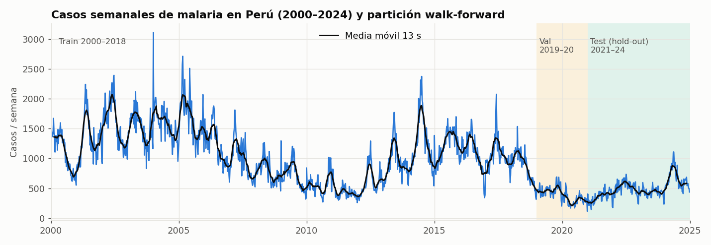

- Tendencia de largo plazo decreciente (de ~1,500 casos/semana en 2000–2006 a
  ~450 en 2021–2024) con **rebrotes plurianuales** (2013–2017).
- **Fuerte dependencia temporal**: autocorrelación de la serie nacional
  ρ(1) = 0.92, ρ(4) = 0.88, ρ(52) = 0.72. Justifica features de lags y medias
  móviles, y obliga a validar **sin mezclar pasado y futuro**.
- La partición es **walk-forward por año**: train ≤ 2018 < validación
  2019–2020 < test 2021–2024.

#### 1.2 Distribución del target: inflación de ceros y sobredispersión

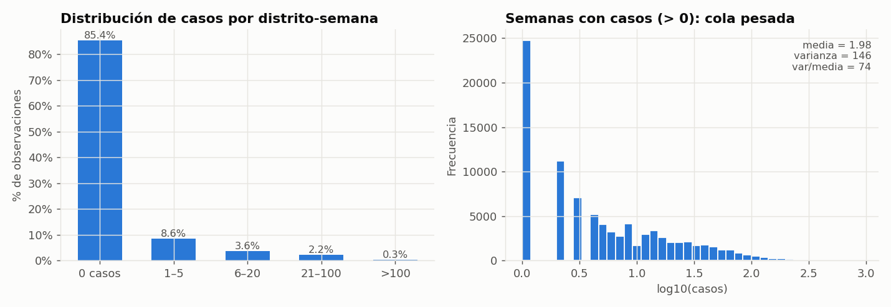

| Estadístico | Valor | Implicación de modelado |
|---|---|---|
| % distrito-semanas con 0 casos | **85.4 %** | Datos **cero-inflados**: métricas porcentuales tipo MAPE explotan (división por 0) → se usa **WAPE** |
| Media | 1.98 casos | |
| Varianza | 145.9 | |
| Índice de dispersión (var/media) | **73.7** | Muy lejos de Poisson (=1): **sobredispersión extrema**, cola pesada → pronóstico **por cuantiles** en vez de un solo punto |

#### 1.3 Concentración espacial

<table>
<tr>
<td width="55%">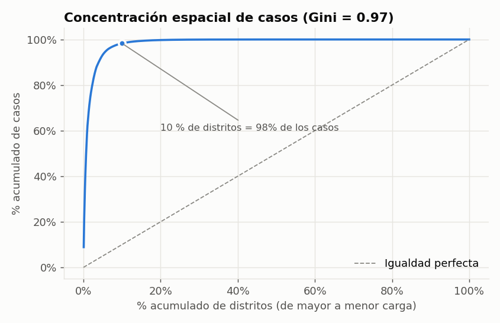</td>
<td>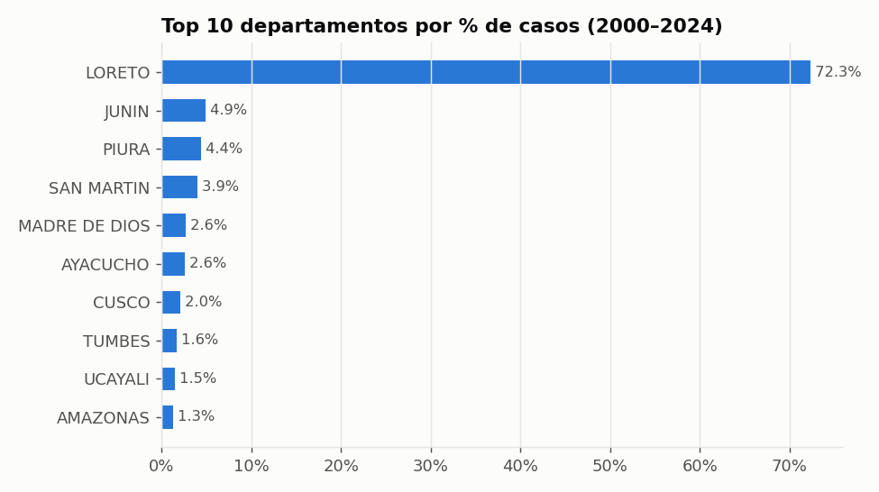</td>
</tr>
</table>

| Indicador | Valor |
|---|---|
| Coeficiente de **Gini** entre distritos | **0.97** |
| % de casos en el 1 % de distritos con más carga | **60.5 %** |
| % de casos en el 10 % de distritos con más carga | **98.3 %** |
| Participación de Loreto | **72.3 %** |

La carga está extremadamente concentrada. Por eso se reporta el error
**ponderado por volumen (WAPE)** y además un análisis por departamento y por
estrato de actividad (sección 7).

#### 1.4 Estacionalidad y composición por especie

<table>
<tr>
<td width="55%">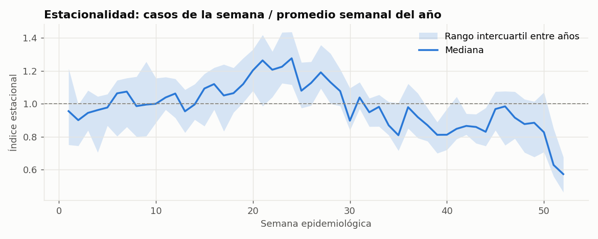</td>
<td>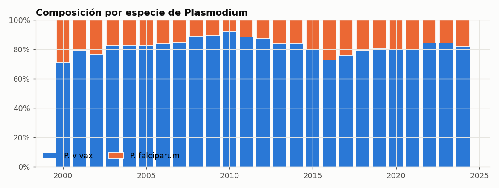</td>
</tr>
</table>

- Pico estacional mediano en la **semana epidemiológica 24** (≈ +28 % sobre el
  promedio anual) y valle a fin de año; se codifica con `sin/cos` de la semana.
- *P. vivax* representa el **81.6 %** de los casos; *P. falciparum* (más grave)
  el resto, con picos de participación en 2000 y 2016–2017.

#### 1.5 Calidad de datos detectada

| Hallazgo | Magnitud | Tratamiento |
|---|---|---|
| Filas con nombres de distrito vacíos | 473 | Autorrellenadas desde tabla INEI (`src/ingestion/renace.py`) |
| Filas con edad corrupta | 44 | Limpiadas a NaN |
| Registros en semana epidemiológica 53 | 501 | El índice temporal asume 52 semanas; genera **301 colisiones** (distrito, semana) en la grilla (0.05 % de 610,915 filas). Documentado como limitación conocida |
| Semanas sin casos no reportadas | ~467 k filas | `complete_weekly_grid` las rellena con 0 para que los lags representen tiempo real |

---

### 2. Diseño experimental

| Elemento | Decisión | Justificación estadística |
|---|---|---|
| Unidad de análisis | distrito (UBIGEO) × semana epidemiológica | Nivel al que se toman decisiones logísticas |
| Target | `cases_total` en t + h, h ∈ {1, 2, 3, 4} | Un modelo directo por horizonte (estrategia *direct multi-step*) evita acumular error recursivo |
| Partición | **Walk-forward temporal** (train 2000–2018, val 2019–2020, test 2021–2024) | Un split aleatorio filtra información del futuro e infla el desempeño |
| Selección de modelo | Solo con **validación**; el **test es hold-out** puro | Evita sesgo de selección (*winner's curse*) al reportar el desempeño final |
| Candidatos | Naive, Naive estacional, Media móvil 4 s, LightGBM cuantil | "Complejidad justificada por evidencia": el ML debe ganarle a heurísticas simples |
| Salida | Cuantiles τ = 0.1, 0.5, 0.9 (intervalo del 80 %) | Target sobredisperso: la incertidumbre es tan importante como el punto |
| Muestra de comparación | Misma muestra para campeón, naive y media móvil; naive estacional en su propio subconjunto (requiere 52 semanas de historia) | Comparación pareada justa |
| Tamaño de la evaluación | Val: ~16.6 k obs (104 semanas, 177 distritos activos). Test: ~22.1 k obs (207 semanas, 147 distritos activos) | |

**Features del modelo (16):** `cases_total`, `cases_vivax`, `cases_falciparum`,
`lag_1..lag_4`, `rolling_mean_4`, `rolling_std_4`, `growth_rate`, `week_sin`,
`week_cos`, `vivax_ratio`, `falciparum_ratio`, `neighbor_cases_lag_1`
(suma de casos en distritos colindantes la semana anterior, con adyacencia real
INEI) y `neighbor_count`. Todas usan solo información disponible en t
(sin fuga de datos).

---

### 3. Catálogo de métricas utilizadas

Sea *yᵢ* el valor real, *ŷᵢ* la predicción (mediana q0.5 para LightGBM),
*l̂ᵢ*, *ûᵢ* los cuantiles q0.1 y q0.9, y α = 0.2.

| Familia | Métrica | Fórmula | Qué mide / por qué se usa |
|---|---|---|---|
| Puntual | **MAE** | (1/n) Σ \|yᵢ − ŷᵢ\| | Error medio en casos; interpretable para logística |
| Puntual | **RMSE** | √[(1/n) Σ (yᵢ − ŷᵢ)²] | Penaliza errores grandes (brotes) |
| Puntual | **WAPE** ⭐ | Σ \|yᵢ − ŷᵢ\| / Σ yᵢ | **Métrica de selección.** Robusta a ceros (a diferencia de MAPE) y ponderada por volumen |
| Puntual | **Sesgo %** | Σ (ŷᵢ − yᵢ) / Σ yᵢ | Sub (−) o sobre (+) estimación sistemática del volumen total |
| Puntual | **Skill vs naive** | 1 − MAE / MAE_naive | Ganancia relativa sobre la persistencia |
| Probabilística | **Pinball loss** (τ) | (1/n) Σ max(τ·eᵢ, (τ−1)·eᵢ), eᵢ = yᵢ − q̂τ | Función de pérdida propia de cada cuantil; es la que optimiza LightGBM |
| Probabilística | **WIS** | [½\|y − m\| + (α/2)·IS_α] / 1.5 | *Weighted Interval Score* (Bracher et al., 2021), estándar de los hubs de forecasting del CDC; aproxima el CRPS |
| Probabilística | **Interval Score** IS_α | (û − l̂) + (2/α)(l̂ − y)·𝟙[y < l̂] + (2/α)(y − û)·𝟙[y > û] | Premia intervalos estrechos, castiga los que no contienen al valor real |
| Probabilística | **Cobertura 80 %** | (1/n) Σ 𝟙[l̂ᵢ ≤ yᵢ ≤ ûᵢ] | Debería ser ≈ 80 %; se reporta total, con y > 0 y con y = 0 |
| Probabilística | **Nitidez** (sharpness) | (1/n) Σ (ûᵢ − l̂ᵢ) | Ancho medio del intervalo: a igual cobertura, más estrecho es mejor |
| Probabilística | **Calibración** | P(y < q̂τ) ≤ τ ≤ P(y ≤ q̂τ) | Versión para datos de conteo (discretos) de la calibración por cuantil |
| Inferencia | **Diebold-Mariano** | DM = d̄ / √(V̂_HAC / T), con corrección HLN | ¿La diferencia de error vs. el mejor baseline es significativa? Pérdida = error absoluto agregado por semana; varianza Newey-West (Bartlett) |
| Inferencia | **Bootstrap por bloques** | 1,000 réplicas, bloques de 8 semanas | IC 95 % de WAPE y de la mejora relativa, respetando la autocorrelación temporal |
| Decisión | **Precision@20** | \|Top20(ŷ) ∩ Top20(y)\| / 20 por semana | De los 20 distritos que el modelo prioriza, ¿cuántos están realmente entre los 20 con más casos? |

---

### 4. Resultados: precisión del pronóstico puntual

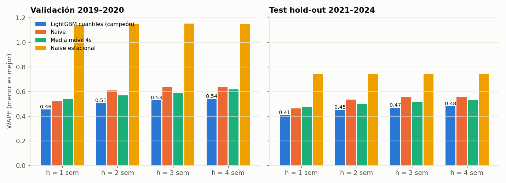

#### 4.1 Test hold-out 2021–2024 (desempeño esperado en producción)

| h | Modelo | MAE | RMSE | **WAPE** | Sesgo % | Skill vs naive |
|---|---|---:|---:|---:|---:|---:|
| 1 | **LightGBM cuantil** 🏆 | **1.874** | **6.46** | **0.408** | −15.1 % | **+12.2 %** |
| 1 | Naive | 2.135 | 7.05 | 0.465 | −0.4 % | 0.0 % |
| 1 | Media móvil 4 s | 2.183 | 7.41 | 0.475 | −1.1 % | −2.3 % |
| 1 | Naive estacional | 4.139 | 12.55 | 0.745 | −19.0 % | −68.5 % |
| 2 | **LightGBM cuantil** 🏆 | **2.088** | **7.32** | **0.453** | −18.1 % | **+15.5 %** |
| 2 | Media móvil 4 s | 2.292 | 7.83 | 0.497 | −1.4 % | +7.3 % |
| 2 | Naive | 2.472 | 8.33 | 0.536 | −0.7 % | 0.0 % |
| 3 | **LightGBM cuantil** 🏆 | **2.171** | **7.69** | **0.468** | −20.9 % | **+15.8 %** |
| 3 | Media móvil 4 s | 2.381 | 8.12 | 0.514 | −1.8 % | +7.6 % |
| 3 | Naive | 2.578 | 8.78 | 0.556 | −0.9 % | 0.0 % |
| 4 | **LightGBM cuantil** 🏆 | **2.235** | **7.98** | **0.480** | −23.0 % | **+14.0 %** |
| 4 | Media móvil 4 s | 2.461 | 8.40 | 0.529 | −2.1 % | +5.3 % |
| 4 | Naive | 2.598 | 8.99 | 0.558 | −1.2 % | 0.0 % |

#### 4.2 Validación 2019–2020 (usada para elegir el campeón)

| h | WAPE LightGBM | WAPE mejor baseline | Mejora | Campeón registrado |
|---|---:|---:|---:|---|
| 1 | **0.456** | 0.520 (naive) | 12.4 % | `lightgbm_quantile` |
| 2 | **0.506** | 0.569 (media móvil) | 11.0 % | `lightgbm_quantile` |
| 3 | **0.528** | 0.590 (media móvil) | 10.4 % | `lightgbm_quantile` |
| 4 | **0.542** | 0.616 (media móvil) | 12.1 % | `lightgbm_quantile` |

Naive estacional en validación: WAPE ≈ 1.15 en los 4 horizontes (descartado).

**Lectura:** el campeón gana en **los 4 horizontes y en ambos periodos**, y la
ventaja **se mantiene fuera de muestra** (test), lo que descarta sobreajuste a
la validación. El error crece suavemente con el horizonte (0.41 → 0.48), como
es esperable. En el agregado nacional el error es mucho menor
(**WAPE nacional = 0.18**, correlación de Pearson r = 0.85) porque los errores
distritales se compensan.

> **¿Qué significa WAPE 0.41?** Que la suma de errores absolutos equivale al
> 41 % del volumen real de casos. Es útil para planificación logística y
> priorización territorial, no para diagnóstico individual.

---

### 5. Significancia estadística de la mejora

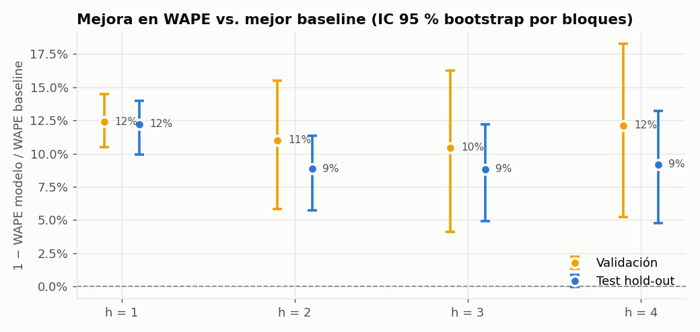

| Periodo | h | Mejor baseline | Mejora WAPE | **IC 95 % bootstrap** | IC 95 % WAPE campeón | **DM (HLN)** | **p-valor** |
|---|---|---|---:|---|---|---:|---:|
| Test | 1 | Naive | 12.2 % | [9.9 %, 14.0 %] | [0.389, 0.428] | −10.66 | 2.1 × 10⁻²¹ |
| Test | 2 | Media móvil | 8.9 % | [5.7 %, 11.4 %] | [0.432, 0.474] | −5.62 | 6.2 × 10⁻⁸ |
| Test | 3 | Media móvil | 8.8 % | [4.9 %, 12.2 %] | [0.447, 0.490] | −4.51 | 1.1 × 10⁻⁵ |
| Test | 4 | Media móvil | 9.2 % | [4.8 %, 13.2 %] | [0.459, 0.503] | −4.27 | 3.0 × 10⁻⁵ |
| Val | 1 | Naive | 12.4 % | [10.5 %, 14.5 %] | [0.426, 0.496] | −7.55 | 1.8 × 10⁻¹¹ |
| Val | 2 | Media móvil | 11.0 % | [5.8 %, 15.5 %] | [0.467, 0.546] | −4.17 | 6.4 × 10⁻⁵ |
| Val | 3 | Media móvil | 10.4 % | [4.1 %, 16.3 %] | [0.486, 0.579] | −3.26 | 1.5 × 10⁻³ |
| Val | 4 | Media móvil | 12.1 % | [5.2 %, 18.3 %] | [0.493, 0.596] | −3.31 | 1.3 × 10⁻³ |

- **H₀ (Diebold-Mariano):** igual precisión esperada entre campeón y mejor
  baseline. Se **rechaza en los 8 casos** (α = 0.05). El estadístico negativo
  indica que el campeón tiene menor pérdida.
- Ningún IC bootstrap incluye el 0 → la mejora es **robusta**, no producto del azar.
- Metodología: para respetar la dependencia temporal y la correlación
  espacial dentro de una misma semana, el bootstrap remuestrea **bloques de 8
  semanas completas** (todos los distritos juntos) y el DM usa la serie
  semanal del diferencial de pérdida con varianza HAC Newey-West.

---

### 6. Resultados probabilísticos: intervalos y calibración

#### 6.1 Métricas de cuantiles (test)

| h | Pinball q0.1 | Pinball q0.5 | Pinball q0.9 | **WIS** | Cobertura 80 % (total) | Cobertura (y > 0) | Ancho medio | Ancho medio (y > 0) |
|---|---:|---:|---:|---:|---:|---:|---:|---:|
| 1 | 0.398 | 0.937 | 0.577 | **1.275** | 92.3 % | **76.4 %** | 6.95 | 21.0 |
| 2 | 0.400 | 1.044 | 0.658 | **1.402** | 91.9 % | **75.7 %** | 7.24 | 21.7 |
| 3 | 0.413 | 1.086 | 0.696 | **1.463** | 91.9 % | **76.9 %** | 7.58 | 22.7 |
| 4 | 0.414 | 1.118 | 0.722 | **1.502** | 92.3 % | **76.7 %** | 7.73 | 23.1 |

En validación: WIS 0.74 a 0.87, cobertura total 94.1 % a 94.5 %, cobertura con
y > 0 entre 73.4 % y 74.7 %.

#### 6.2 Cobertura desagregada: la cifra "94 %" necesita contexto

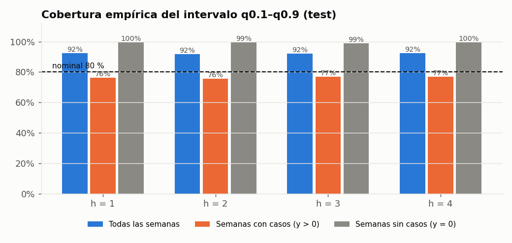

La cobertura agregada (92–94 %) **supera** el 80 % nominal, pero esa cifra está
inflada por las semanas sin casos (68–80 % de la muestra), donde el intervalo
[0, algo] contiene al 0 casi siempre (99–100 %). **En las semanas con casos,
que son las que importan para la decisión, la cobertura es 76–77 %**, es decir
**ligeramente por debajo** del 80 % nominal. Conclusión estadística: el
intervalo es conservador en la masa de ceros y un poco estrecho en semanas
activas; un ajuste de **conformal prediction** por estrato es la mejora natural.

#### 6.3 Calibración por cuantil para datos de conteo

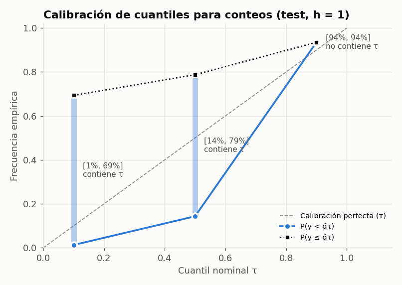

Con datos discretos no se exige P(y < q̂τ) = τ, sino
**P(y < q̂τ) ≤ τ ≤ P(y ≤ q̂τ)**:

| Cuantil τ | P(y < q̂τ) | P(y ≤ q̂τ) | ¿Calibrado? |
|---|---:|---:|---|
| 0.1 | 1.3 % | 69.3 % | ✅ contiene τ |
| 0.5 | 14.3 % | 78.8 % | ✅ contiene τ |
| 0.9 | 93.5 % | 93.5 % | ⚠️ q0.9 algo alto (conservador) |

---

### 7. Análisis de errores: dónde acierta y dónde falla

#### 7.1 Por estrato de actividad (test, h = 1)

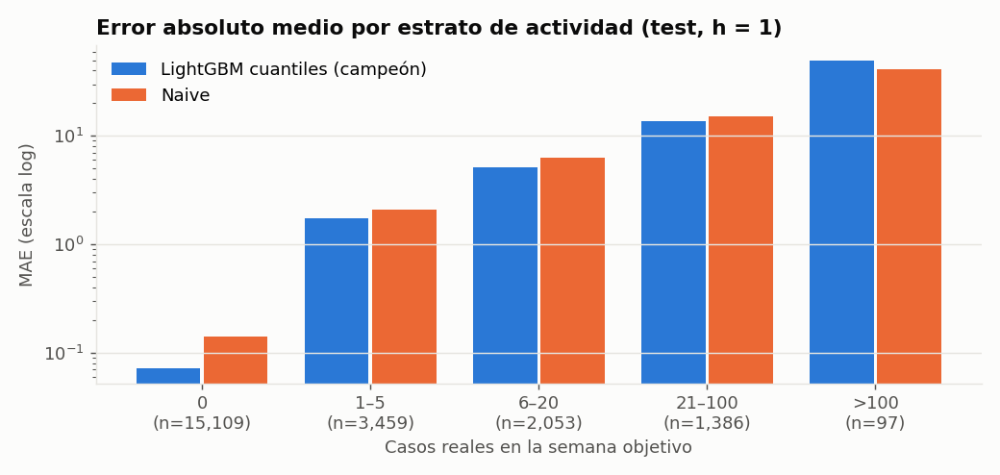

| Casos reales | n | % del volumen | MAE campeón | MAE naive | Sesgo campeón | Cobertura 80 % |
|---|---:|---:|---:|---:|---:|---:|
| 0 | 15,109 | 0.0 % | **0.07** | 0.14 | +0.07 | 99.6 % |
| 1–5 | 3,459 | 7.5 % | **1.74** | 2.08 | −0.01 | 70.1 % |
| 6–20 | 2,053 | 22.8 % | **5.15** | 6.29 | −0.85 | 85.2 % |
| 21–100 | 1,386 | 56.8 % | **13.66** | 15.14 | −7.35 | 80.5 % |
| > 100 | 97 | 13.0 % | 49.63 | **40.90** | −45.5 | 53.6 % |

**Hallazgo clave:** el campeón gana en todos los estratos **excepto en picos
extremos (> 100 casos/semana)**, donde subestima fuertemente (sesgo −45 casos)
y su cobertura cae a 54 %. Es el comportamiento típico de modelos de árboles
con pérdida cuantil (no extrapolan fuera del rango visto y la mediana "encoge"
hacia el centro). Para alertas de brote, esto se mitiga usando **q0.9** como
umbral de alerta en vez de la mediana.

#### 7.2 Por departamento (test, h = 1)

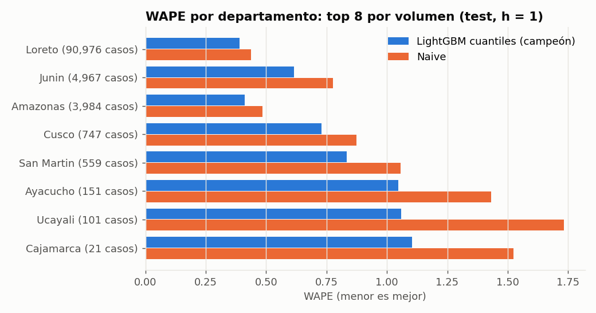

| Departamento | Casos (test) | WAPE campeón | WAPE naive | Mejora |
|---|---:|---:|---:|---:|
| Loreto | 90,976 | **0.389** | 0.437 | 10.8 % |
| Junín | 4,967 | **0.615** | 0.777 | 20.8 % |
| Amazonas | 3,984 | **0.412** | 0.484 | 14.9 % |
| Cusco | 747 | **0.730** | 0.873 | 16.4 % |
| San Martín | 559 | **0.833** | 1.057 | 21.2 % |
| Ayacucho | 151 | **1.048** | 1.430 | 26.7 % |
| Ucayali | 101 | **1.059** | 1.733 | 38.9 % |
| Cajamarca | 21 | **1.105** | 1.524 | 27.5 % |

El modelo le gana al naive en **los 8 departamentos con más casos**. En
departamentos de baja incidencia el WAPE es alto (> 1) porque el denominador es
pequeño: pocos casos esporádicos son intrínsecamente impredecibles.

#### 7.3 Ejemplo de un distrito: Andoas (Loreto), el de mayor carga en test

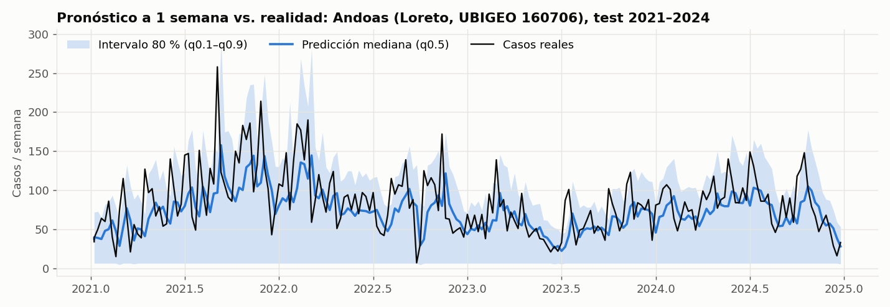

WAPE = **0.31**, cobertura del intervalo 80 % = **84 %**. La mediana sigue la
dinámica de la serie; el intervalo se abre en los periodos de mayor volatilidad.

#### 7.4 Agregado nacional y valor para la decisión

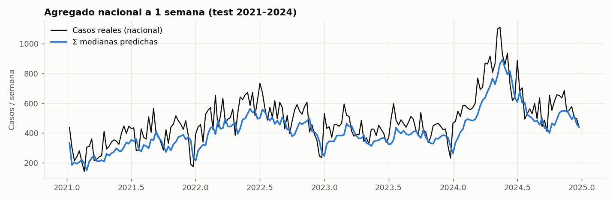

| Indicador (test, h = 1) | Valor |
|---|---|
| WAPE nacional (suma de medianas vs. total real) | **0.185** |
| Correlación de Pearson semanal | **0.85** |
| Sesgo nacional | −15.1 % |
| **Precision@20** campeón vs. naive | **86.5 %** vs. 84.6 % |

La Precision@20 indica que, de los 20 distritos que el sistema prioriza cada
semana, en promedio **17.3 están realmente entre los 20 con más casos**.

---

### 8. Interpretabilidad

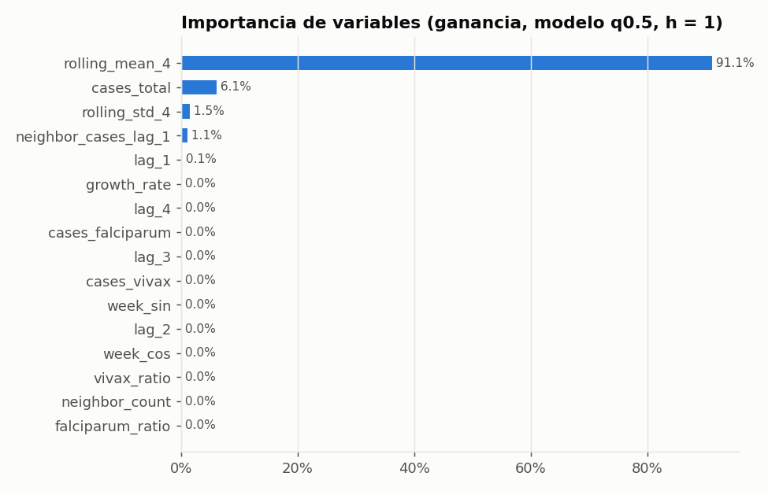

| Variable | Ganancia | Interpretación |
|---|---:|---|
| `rolling_mean_4` | 91.1 % | Nivel reciente del distrito: la malaria es muy persistente (ρ(1) = 0.92) |
| `cases_total` (semana actual) | 6.1 % | Última observación |
| `rolling_std_4` | 1.5 % | Volatilidad reciente → modula el ancho de los cuantiles |
| `neighbor_cases_lag_1` | 1.1 % | **Contagio espacial**: casos en distritos vecinos |
| Resto (lags, estacionalidad, especie) | < 0.3 % | Información redundante con la media móvil |

**Lectura honesta:** el modelo aprende principalmente un **suavizado del nivel
reciente con corrección no lineal** (ajuste por volatilidad, vecinos y
contracción de outliers). Eso explica por qué le gana a la media móvil simple
pero de forma moderada (~9–12 %), y señala dónde está el margen de mejora:
covariables exógenas (clima, movilidad, intervenciones) que aporten
información que la historia del propio distrito no contiene.

---

### 9. Conclusiones estadísticas y limitaciones

**Conclusiones**

1. El campeón LightGBM cuantil **supera a todos los baselines en los 4
   horizontes**, en validación y en el **hold-out 2021–2024**, con mejoras de
   9 % a 12 % en WAPE **estadísticamente significativas** (DM p < 0.002 en
   los 8 casos; IC bootstrap que excluyen el 0).
2. El desempeño **no se degrada fuera de muestra** (test WAPE 0.41–0.48 vs.
   validación 0.46–0.54), evidencia de buena generalización temporal.
3. Los intervalos del 80 % tienen una cobertura cercana a la nominal en semanas
   con casos (76–77 %) y son útiles para planificación por escenarios.

**Limitaciones cuantificadas y próximos pasos**

| Limitación | Evidencia | Mejora propuesta |
|---|---|---|
| Mediana sesgada a la baja | Sesgo −15 % a −23 % del volumen | Reportar también la media (modelo Tweedie/Poisson) para logística de volumen total |
| Subestima picos > 100 casos | MAE 49.6 vs 40.9 del naive; cobertura 54 % | Umbral de alerta con q0.9; features de brote; modelos con cola pesada |
| Cobertura dispar (ceros vs. activos) | 99.6 % vs 76 % | **Conformal prediction** estratificado |
| Solo distritos con historia activa | Test: 147 distritos activos de 1,645 | Extender la grilla hasta la fecha de corte para modelar "reemergencia" |
| Semana 53 en índice de 52 | 301 colisiones (0.05 %) | Calendario epidemiológico oficial |
| Sin covariables climáticas en el campeón | TFT + clima (Etapa 2): WAPE 1.33, no supera al campeón | Más épocas, búsqueda de hiperparámetros, clima a nivel provincia |

---

## 🏗️ Arquitectura del sistema (MLOps)

### Vista end-to-end

La plataforma sigue el patrón **FTI (Feature / Training / Inference pipelines)**:
tres pipelines desacoplados que se comunican solo a través de artefactos
versionados (capa *gold*, registro de modelos, `champion.json`).

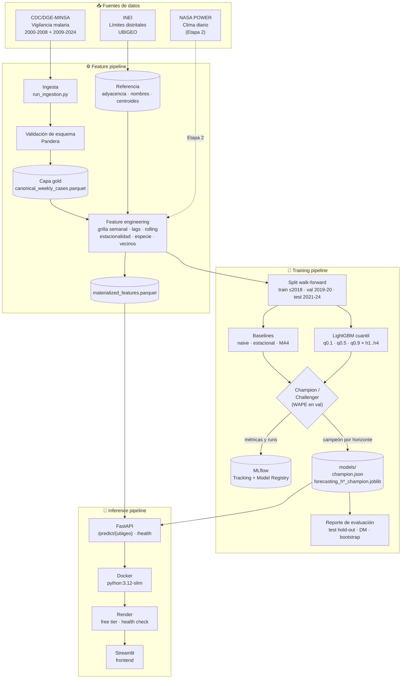

### Flujo de entrenamiento y selección Champion/Challenger

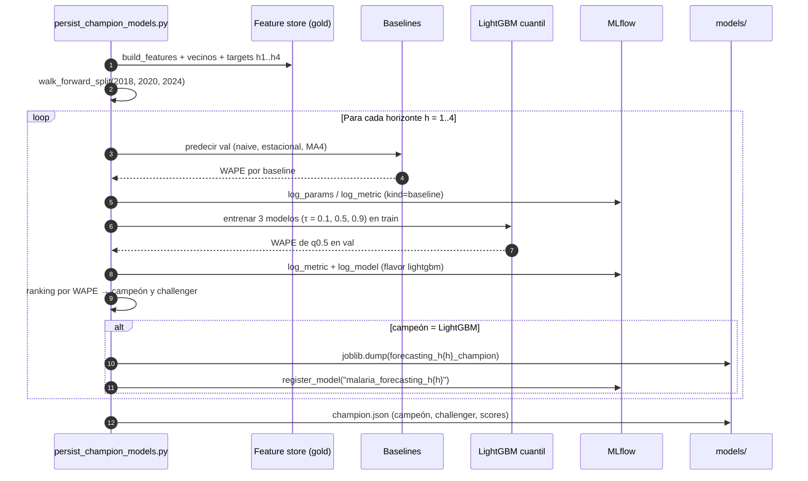

### Flujo de inferencia en producción

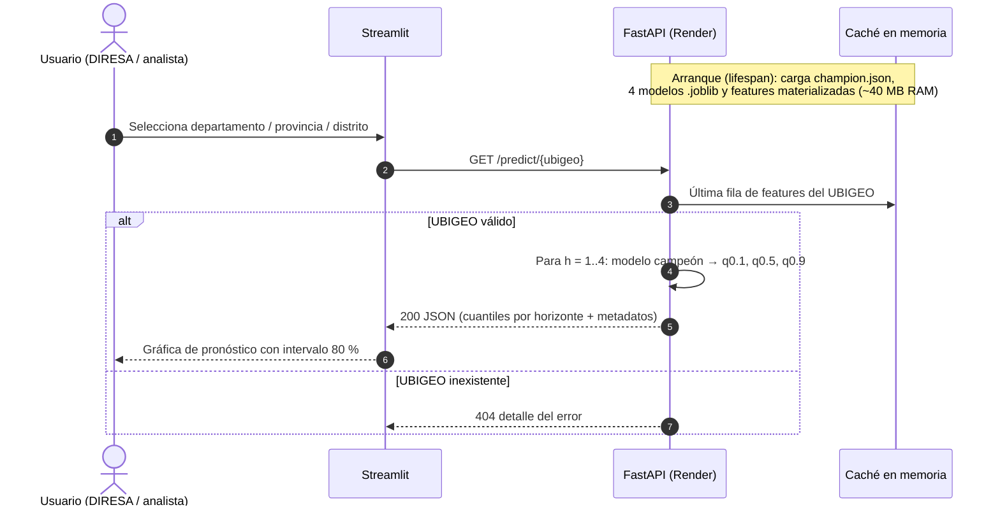

### Stack tecnológico por capa

| Capa | Tecnología | Rol |
|---|---|---|
| Datos | pandas, PyArrow (Parquet), YAML | Capas raw → gold, configuración declarativa |
| Calidad de datos | **Pandera** | Contratos de esquema en la ingesta |
| Features | pandas, adyacencia INEI (shapely, una sola vez) | Lags, rolling, estacionalidad cíclica, contagio espacial |
| Modelado | **LightGBM** (objective = quantile), PyTorch Forecasting (TFT, Etapa 2) | Pronóstico probabilístico multi-horizonte |
| Evaluación | NumPy, SciPy, matplotlib | Métricas puntuales y probabilísticas, DM, bootstrap, gráficas |
| Tracking y registro | **MLflow** (SQLite backend, Model Registry) | Trazabilidad de runs y versionado de modelos |
| Serving | **FastAPI** + Pydantic + Uvicorn | API REST con OpenAPI (Swagger / ReDoc) |
| Contenedor | **Docker** (python:3.12-slim + libgomp) | Imagen reproducible con solo dependencias de producción |
| Despliegue | **Render** (blueprint `render.yaml`) | Web service con health check `/health` |
| Frontend | **Streamlit** | Consulta interactiva por distrito |
| Calidad de código | pytest (50 tests), ruff, mypy | Tests unitarios y de integración, lint y tipado |

### Decisiones de diseño MLOps

| Decisión | Alternativa descartada | Motivo |
|---|---|---|
| Features **materializadas** en Parquet para la API | Recalcular features al arrancar | Reduce RAM de ~500 MB a ~40 MB: cabe en el free tier de Render (512 MB) |
| Un modelo **por horizonte y cuantil** | Un único modelo recursivo | Evita propagación de error; cada horizonte se selecciona por separado |
| `champion.json` como contrato entre training e inferencia | Acoplar la API a MLflow | La API arranca sin depender de un servidor de tracking |
| Base SQLite de MLflow **fuera** del repo | Dentro de la carpeta del proyecto | SQLite falla con locks en carpetas sincronizadas (OneDrive) |
| Baselines como fórmulas, no artefactos | Serializar baselines | Si un baseline gana un horizonte, la API lo aplica sin archivo extra |
| Reporte de evaluación **como pipeline** | Métricas en un notebook | Reproducible, versionable y regenerable ante cada reentrenamiento |

### Nivel de madurez MLOps (marco de Google Cloud)

| Capacidad | Nivel 0 (manual) | Nivel 1 (pipeline automatizado) | Estado del proyecto |
|---|---|---|---|
| Pipelines modulares y reproducibles | | ✅ | ✅ Ingesta, features, training, evaluación e inferencia separados |
| Validación de datos | | ✅ | ✅ Pandera |
| Tracking y registro de modelos | | ✅ | ✅ MLflow + Model Registry |
| Selección automática del campeón | | ✅ | ✅ Champion/Challenger por horizonte |
| Serving containerizado | | ✅ | ✅ Docker + Render |
| Tests automatizados | | ✅ | ✅ 50 tests |
| CI/CD | | | 🔧 En progreso (Fase 8) |
| Monitoreo de drift y reentrenamiento | | | ⏸️ Pendiente (Fase 7) |

---

## 🚀 API de predicción

API REST desplegada con **FastAPI** en **Render**
(`https://malaria-prediction-peru.onrender.com`, el primer request puede tardar
~30 s por el *cold start* del plan gratuito).

| Método | Ruta | Descripción |
|--------|------|-------------|
| `GET` | `/predict/{ubigeo}` | Predicción de casos para un distrito (4 horizontes, 3 cuantiles) |
| `GET` | `/health` | Estado del servicio y modelos cargados |
| `GET` | `/docs` | Documentación interactiva (Swagger UI) |
| `GET` | `/redoc` | Documentación alternativa (ReDoc) |

### Ejemplo real: Iquitos (UBIGEO 160101)

```bash
curl http://127.0.0.1:8000/predict/160101
```

```json
{
  "ubigeo": "160101",
  "departamento": "LORETO",
  "provincia": "MAYNAS",
  "distrito": "IQUITOS",
  "as_of_epi_year": 2024,
  "as_of_epi_week": 52,
  "predictions": [
    {
      "horizon": 1,
      "champion": "lightgbm_quantile",
      "quantiles": {"q0.1": 3.28, "q0.5": 10.80, "q0.9": 20.43},
      "point_estimate": null
    },
    {
      "horizon": 2,
      "champion": "lightgbm_quantile",
      "quantiles": {"q0.1": 2.54, "q0.5": 9.12, "q0.9": 18.71},
      "point_estimate": null
    }
  ]
}
```

**Lectura:** para Iquitos, a 1 semana, la mediana es de **~11 casos**, con un
intervalo del 80 % entre **3 y 20 casos**.

### Casos de uso

1. **Alerta semanal por distrito:** si q0.5 supera varias veces el promedio
   histórico del distrito, o q0.9 cruza un umbral operativo, se activa alerta.
2. **Priorización logística:** ranking semanal de distritos por q0.5
   (Precision@20 = 86.5 % en test).
3. **Evaluación de intervenciones:** comparar casos observados después de una
   campaña con el pronóstico previo como contrafactual aproximado.
4. **Dashboard:** el frontend Streamlit (`frontend/streamlit/app.py`) consume la
   API y grafica el pronóstico con su intervalo.

---

## 📈 Estado del proyecto

| Fase | Descripción | Estado |
|------|-------------|--------|
| 0 | Scaffolding del proyecto | ✅ Hecho |
| 1 | Ingesta + validación de esquemas | ✅ Hecho |
| 2 | Feature engineering (temporal, epidemiológico, espacial) | ✅ Hecho |
| 3a | LightGBM cuantiles + features espaciales: **modelo campeón** | ✅ Validado con datos reales |
| 3b | Champion/Challenger + registro en MLflow | ✅ Hecho |
| 3c | **Reporte estadístico** (test hold-out, DM, bootstrap, calibración) | ✅ Hecho |
| 4 | Temporal Fusion Transformer + clima (NASA POWER) | ⚠️ Entrenado, pierde vs. campeón (WAPE 1.33) |
| 5 | GNN espacio-temporal (opcional) | ⏸️ En pausa |
| 6 | API de inferencia (FastAPI) + frontend Streamlit | ✅ Hecha y probada end-to-end |
| 7 | Monitoreo, drift y política de reentrenamiento | ⏸️ En pausa |
| 8 | Despliegue (Render) + CI/CD | 🔧 En progreso |

---

## 📂 Estructura del proyecto

```
malaria-prediction-peru/
├── api/                    # API de inferencia (FastAPI)
│   ├── main.py             #   Endpoints: /predict, /health, /docs
│   └── schemas.py          #   Modelos Pydantic de request/response
├── frontend/streamlit/     # Frontend de consulta por distrito
├── src/                    # Código de librería
│   ├── ingestion/          #   Carga y limpieza de datos crudos
│   ├── validation/         #   Esquemas Pandera
│   ├── features/           #   Feature engineering (temporal, epi, espacial, clima)
│   ├── preprocessing/      #   Split walk-forward y transformaciones
│   ├── models/             #   LightGBM cuantil, TFT, baselines
│   ├── evaluation/         #   Métricas (WAPE, pinball loss, cobertura)
│   └── inference/          #   Lógica de predicción para la API
├── pipelines/              # Scripts orquestables
│   ├── ingestion/          #   run_ingestion.py
│   ├── training/           #   run_baselines, run_ml_models, persist_champion, run_tft
│   ├── evaluation/         #   run_evaluation_report.py (este reporte)
│   └── reference/          #   Tablas de referencia (adyacencia, nombres, clima)
├── configs/                # Configuración declarativa (data.yaml, model.yaml)
├── models/                 # champion.json + forecasting_h*_champion.joblib
├── data/
│   ├── raw/                #   CSVs originales (no versionados, ~77 MB)
│   ├── gold/               #   Tabla canónica y features materializadas
│   └── reference/          #   Adyacencia, nombres, centroides, GeoJSON
├── docs/
│   ├── architecture.md     #   Fundamentación académica y etapas de modelado
│   ├── results/            #   metrics.json + tablas CSV del reporte
│   └── images/results/     #   15 gráficas del reporte
├── tests/                  # 50 tests (unitarios e integración)
├── Dockerfile              # Imagen para despliegue en Render
├── render.yaml             # Blueprint del servicio en Render
└── pyproject.toml          # Dependencias y configuración
```

---

## 🔧 Guía de desarrollo

### Requisitos previos

- Python 3.12+
- Los dos CSVs de la [Plataforma Nacional de Datos Abiertos](https://datosabiertos.gob.pe/dataset/vigilancia-epidemiol%C3%B3gica-de-malaria)
  (CDC Perú / DGE-MINSA) en `data/raw/epidemiology/`:
  - `datos_abiertos_vigilancia_malaria_2000_2008.csv` (~5.6 MB)
  - `datos_abiertos_vigilancia_malaria_2009_2024.csv` (~71 MB)

### Instalación

```bash
python -m venv .venv
source .venv/bin/activate  # o .venv\Scripts\activate en Windows
pip install -e ".[dev,monitoring]"
```

### Pipeline completo (de datos crudos a API funcionando)

```bash
# 1. Ingesta: CSV crudo → tabla canónica gold
python -m pipelines.ingestion.run_ingestion

# 2. Baselines (naive, seasonal naive, media móvil)
python -m pipelines.training.run_baselines

# 3. Modelo ML (LightGBM por cuantiles) + features materializadas
python -m pipelines.training.run_ml_models

# 4. Champion/Challenger + registro en MLflow
python -m pipelines.training.persist_champion_models

# 5. Reporte estadístico (gráficas + metrics.json)
python -m pipelines.evaluation.run_evaluation_report

# 6. Levantar la API → http://127.0.0.1:8000/docs
uvicorn api.main:app --reload

# 7. Frontend
streamlit run frontend/streamlit/app.py
```

### Tests y calidad de código

```bash
pytest -v             # 50 tests
ruff check .          # Lint
ruff format .         # Formato
mypy src api          # Tipado
```

### Tablas de referencia (solo la primera vez)

```bash
pip install -e ".[geo]"
python -m pipelines.reference.build_district_adjacency
python -m pipelines.reference.build_district_names
```

### Etapa 2: TFT + clima (experimental)

```bash
pip install -e ".[geo]"
python -m pipelines.reference.build_department_centroids
python pipelines/reference/fetch_climate_data.py     # NASA POWER, reanudable
pip install -e ".[dl]"
python -m pipelines.training.run_tft_model            # o Entrenamiento_TFT_Colab.ipynb con GPU
```

> **Nota sobre TFT:** entrenado con clima real de NASA POWER (25
> departamentos, 2000–2024): WAPE = 1.33, pierde contra baselines y contra
> LightGBM. Causas probables: pocas épocas, sin búsqueda de hiperparámetros y
> sin los lags que sí usa LightGBM. Ver `docs/architecture.md`.

---

## 🌐 Despliegue

```bash
docker build -t malaria-api .
docker run -p 8000:8000 malaria-api
```

Configuración en `render.yaml`: runtime Docker, plan Free, región Oregon,
health check `/health`. Los artefactos necesarios (`champion.json`,
`forecasting_h*_champion.joblib`, `data/gold/`) están versionados en git.

---

## 📝 Notas técnicas

- **Fuente:** [Vigilancia Epidemiológica de Malaria](https://datosabiertos.gob.pe/dataset/vigilancia-epidemiol%C3%B3gica-de-malaria), CDC Perú / DGE-MINSA.
- **MLflow:** la base se guarda en `~/.mlflow-malaria-prediction-peru/`
  (fuera del repo, porque SQLite falla en carpetas sincronizadas con OneDrive).
  Sobreescribible con `MLFLOW_TRACKING_URI`.
- **Features estáticas al arrancar:** para reflejar datos nuevos hay que
  re-correr la ingesta y reiniciar el servicio.
- **Sin monitoreo de drift todavía** (Fase 7).
- **Referencias metodológicas:** Bracher et al. (2021), *Evaluating epidemic
  forecasts in an interval format*, PLOS Comput Biol (WIS); Diebold & Mariano
  (1995) y Harvey, Leybourne & Newbold (1997) (test DM); Künsch (1989)
  (bootstrap por bloques); Hopsworks, patrón FTI. Más literatura en
  `docs/architecture.md`.

---

## 📜 Licencia

MIT

## 👤 Contacto

**Wilder Eslu** · [github.com/wilder14-eslu](https://github.com/wilder14-eslu)
